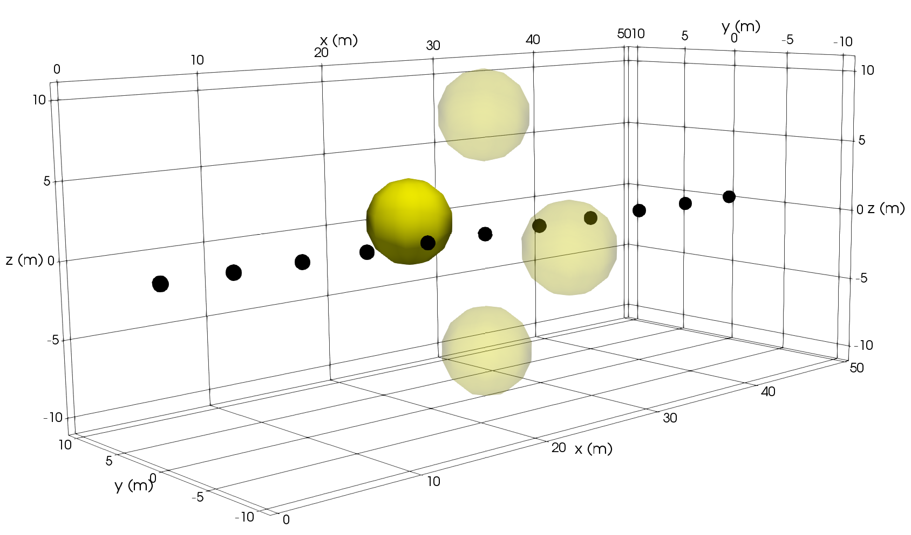

# Using DC Resistivity Ring Array Surveys to Resolve Conductive Structures Around Tunnels or Mine-Workings

_Michael A. Mitchell and Douglas W. Oldenburg_

https://doi.org/10.1016/j.jappgeo.2023.104949



# Summary

In underground environments, conventional direct current (DC) resistivity surveys with a single linear array of electrodes produce fundamentally non-unique inversions. These non-uniqueness and model resolution issues stem from limitations placed on the location of transmitters (TXs) and receivers (RXs) by the geometry of existing tunnels and boreholes. Poor excitation and/or sampling of the region of interest (ROI) can create artifacts and reduce the resolution of the recovered model.

To address these problems we propose the use of an ensemble of ring arrays, which are created by placing one or more electrodes in each face (sidewalls, floor, and ceiling) of the tunnel to form a ring of electrodes at each along-tunnel location. Using a series of increasingly complex synthetic models, we assess the benefits of ring arrays and show that they can be used to better constrain the location and shape of anomalous bodies around the tunnel.

Although ring arrays significantly improve the resolution of the recovered model, the size of the comprehensive ring array survey increases rapidly with the number of electrodes used. To balance model resolution and survey size, we developed a physics-based survey design methodology. In this methodology, TXs are selected based upon secondary charge accumulations on a test block that is moved through the ROI. Although this survey design methodology does not produce a strictly optimal survey, it balances model resolution and survey size in a practical and computationally efficient manner.

Since the ring array more accurately estimates the around-tunnel location of targets and ensures that targets on all sides of the tunnel are detected, it is ideally suited to tunnel-based environments. Our results show that only about $6\%$ of the possible TXs and $0.5\%$ of the RXs in the comprehensive ring array survey are needed to retain the improvements in resolution. Therefore, economical ring array surveys can be designed for both reconnaissance and target characterization. Following the inversion of the reconnaissance dataset, additional rings can be added to reduce the inter-ring spacing or off-tunnel boreholes can be added to the region around identified anomalies to increase resolution as required.


# Citation

Mitchell, M. A., & Oldenburg, D. W. (2023). Using DC resistivity ring array surveys to resolve conductive structures around tunnels or mine-workings. Journal of Applied Geophysics, 211, 104949. https://doi.org/10.1016/j.jappgeo.2023.104949

```
@article{mitchell_applied_2023,
title = {Using DC resistivity ring array surveys to resolve conductive structures around tunnels or mine-workings},
journal = {Journal of Applied Geophysics},
volume = {211},
pages = {104949},
year = {2023},
issn = {0926-9851},
doi = {https://doi.org/10.1016/j.jappgeo.2023.104949},
url = {https://www.sciencedirect.com/science/article/pii/S0926985123000265}
}
```
